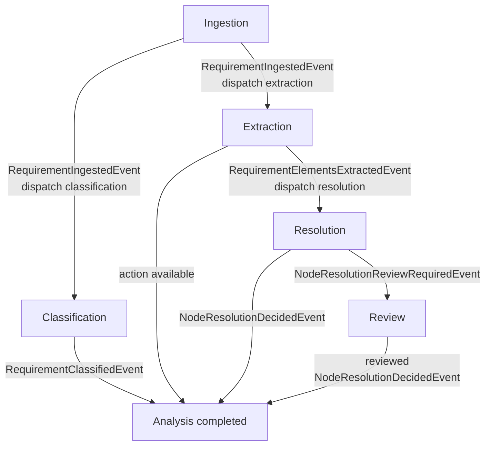

# Orchestration Slice

The Orchestration slice coordinates the end-to-end requirement analysis
workflow. It reacts to application events, dispatches the next slice commands,
tracks workflow state, opens reviews when needed, and publishes completion when
all required decisions exist.

## Business Responsibility

Orchestration is event-driven and correlation-id based. For one requirement
workflow it expects:

- provenance from Ingestion,
- classification from Classification,
- extracted action from Extraction,
- one node resolution decision for every extracted requirement element.

When all of these are present, it publishes
`RequirementAnalysisCompletedEvent`.

Relevant classes:

- `src/main/java/io/fekav/req/orchestration/application/RequirementWorkflowOrchestrator.java`
- `src/main/java/io/fekav/req/orchestration/domain/WorkflowState.java`
- `src/main/java/io/fekav/req/shared/event/RequirementAnalysisCompletedEvent.java`

## Workflow

The workflow transitions are:

- `RequirementIngestedEvent`: store event, then dispatch
  `ClassifyRequirementCommand` and `ExtractSyntaxCommand`.
- `RequirementClassifiedEvent`: store classification and check completion.
- `RequirementElementsExtractedEvent`: store extracted action, collect
  requirement elements, then dispatch `ResolveNodeCommand` for newly expected
  elements.
- `NodeResolutionDecidedEvent`: store the final node decision, close matching
  pending reviews, and check completion.
- `NodeResolutionReviewRequiredEvent`: store the review request, update the
  review projection, and record the ingestion outcome as `REVIEW_REQUIRED`.

The orchestrator is disabled unless `req.orchestration.enabled=true`.



## Requirement Elements

`RequirementElementCollector` converts an extracted `Action` into resolution
targets:

- `SUBJECT` from `Action.subject()`,
- `ACTION` from `Action.actionText()`,
- `OBJECT` from `Action.targetObject()`,
- `CONDITION` for every condition,
- `CONSTRAINT` for every constraint.

Subject, action, and object always come first. Conditions and constraints are
sorted by text for deterministic resolution order.

Relevant class:

- `src/main/java/io/fekav/req/orchestration/domain/RequirementElementCollector.java`

## State and Idempotency

`WorkflowState` is rebuilt by replaying stored application events. Completion
requires provenance, classification, action, and a distinct relevant decision
for every expected requirement element.

`InMemoryEventStore` stores events by correlation id and ignores redelivered
events with the same event id. This prevents repeated command dispatch and
duplicate completion events.

Relevant classes:

- `src/main/java/io/fekav/req/orchestration/application/EventStore.java`
- `src/main/java/io/fekav/req/orchestration/infrastructure/InMemoryEventStore.java`

## Scope Boundary

Orchestration does not perform classification, extraction, resolution, review
decision validation, or graph persistence itself. It coordinates those slices
and defines when their outputs form a complete analysis.

## Tests

The behavior is covered by:

- `src/test/java/io/fekav/req/orchestration/application/RequirementWorkflowOrchestratorTest.java`
- `src/test/java/io/fekav/req/orchestration/application/RequirementWorkflowIntegrationTest.java`
- `src/test/java/io/fekav/req/orchestration/domain/*Test.java`
- `src/test/java/io/fekav/req/orchestration/infrastructure/InMemoryEventStoreTest.java`

The tests verify disabled mode, command dispatch, idempotency, element
collection, completion, review-assisted completion, and event-store behavior.

## Technical Interface

This slice has no direct REST command or query.

Consumed events:

- `RequirementIngestedEvent`
- `RequirementClassifiedEvent`
- `RequirementElementsExtractedEvent`
- `NodeResolutionDecidedEvent`
- `NodeResolutionReviewRequiredEvent`

Dispatched commands:

- `ClassifyRequirementCommand`
- `ExtractSyntaxCommand`
- `ResolveNodeCommand`

Published events:

- `RequirementAnalysisCompletedEvent`

Other output:

- Records `IngestRequirementResult.reviewRequired(...)` in
  `IngestionOutcomeStore` when a node resolution review is required.

Completion event shape:

```json
{
  "eventId": { "value": "..." },
  "occurredAt": "2026-07-07T10:15:30Z",
  "correlationId": { "value": "..." },
  "provenance": { "...": "..." },
  "classification": { "...": "..." },
  "action": { "...": "..." },
  "nodeMatchDecisions": [
    { "...": "..." }
  ]
}
```
